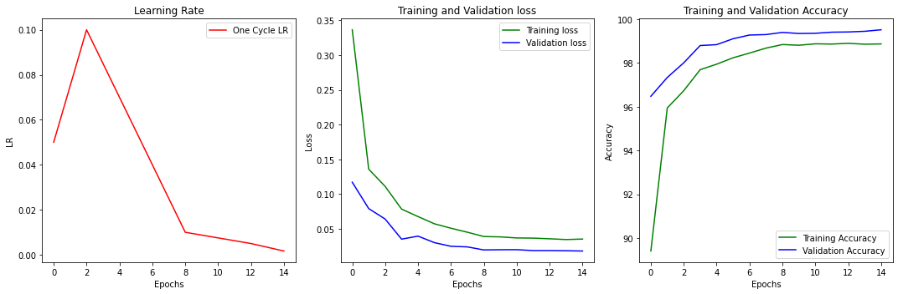
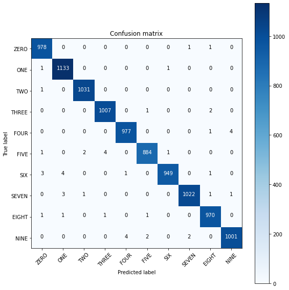
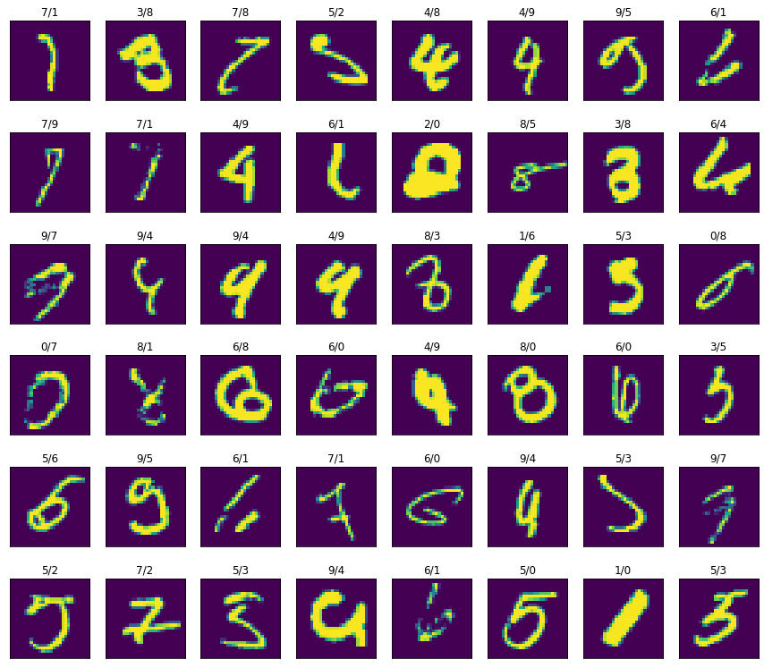

# In this article we will walk you through how to create MNIST digit dataset classifier

The target is to achieve it in under `4k` params with an accuracy of more than `99.52`

### Before we start Remember, `Good news will come only after your training loop ends` So Just Wait


## Table of Contents  
* [Motivation](#moivation-to-keep-you-engaged-till-the-end)
* [Basics](#baics)  
* [Data Loader](#data-loader)
* [Data Visualization](#data-visualization)
* [Network Design](#network-design)
* [Training](#training)
* [Analysis](#analysis)


## Motivation to keep you engaged till the end

The accuracy achieved: `99.52` within `15 epochs` with `3762` params used

Code Link: [Local NoteBook](S6.ipynb)


## Basics
Before we can even start talking about machine learning, model, or training we need to know what kind of problem we are trying to solve here. For us, the problem at hand is classifying a digit image into its respective class (ie what digit a given image belongs to).

## Data Loader
To start with, the first thing we have to do is to load data. As we are working with `PyTorch`, there is an inbuilt functionality that helps us load data as shown below


    batch_size = 32

    train_loader = torch.utils.data.DataLoader(
        datasets.MNIST('../data', train=True, download=True,
                    transform=transforms.Compose([
                        transforms.ToTensor(),
                        transforms.Normalize((0.1307,), (0.3081,))
                    ])),
    batch_size=batch_size, shuffle=True)

    test_loader = torch.utils.data.DataLoader(
        datasets.MNIST('../data', train=False, transform=transforms.Compose([
                            transforms.ToTensor(),
                            transforms.Normalize((0.1307,), (0.3081,))
                        ])),
        batch_size=batch_size, shuffle=True)


this will load mnist data and convert it into `data loader`. DataLoader is a built-in class that provides an iterator to loop over, one of the parameters this takes in is batch size which is used for `minibatch` gradient descent while training.

## Data Visualization
Before we even start creating our model we have to look into what kind of data we are dealing with for this we use `matplotlib` to visualize our data. We will print some samples to see how they look.


As we can see from the above image data samples are all approximately centered.

One of the other things we need to look at in our dataset is the class spread. For this, we visualize our training dataset to know the count of data samples in each class.

    {0: 5923, 1: 6742, 2: 5958, 3: 6131, 4: 5842, 5: 5421, 6: 5918, 7: 6265, 8: 5851, 9: 5949}


From this chart we can clearly see data is evenly spread around all classes, what we can conclude from here is while training our network will not be biased to one class.

## Network Design

Designing a network is an art and an iterative process. And we don't want you to go through that pain. So we are sharing some tips and tricks to design a network.

But before we jump into network architecture we like to point out some of the golden rules to design any network.

1. There are two kinds of network designs `Smooth Design` and `Stepped Design` as shown below. In this article, we have used `Stepped Design`

    
    

2. Try to understand what should be the right size of network you need to start with, Tip: start with like large enough network with millions of parameters, so that once you train, you know you have the right amount of data to solve your problem. Otherwise, you go and collect more data.

3. Do not try every possible optimization in the first iteration. Take one step at a time.

We will now spare you too much of `GYAN` and quickly jump on to the network design used.


This network contains a block pattern as shown. We start with an image of size 1\*28\*28

1. Block 1 -> Convolution with a kernel of size 4\*3\*3 and padding 1, we do two sets of such convolution
2. Transition layer -> Here we have used MaxPolling2D to reduce channel size by half, followed by a dropout of 0.01
3. Block 2 -> Convolution with a kernel of size 8\*3\*3 and padding 1, we do two sets of such convolution
4. Transition layer -> Here we have used MaxPolling2D to reduce channel size by half, followed by a dropout of 0.01
5. Block 2 -> Convolution with a kernel of size 16\*3\*3 and padding 1, we do two sets of such convolution
6. Transition layer -> A 1\*1 convolution is used to reduce the channel from 16 to 10
7. Output layer -> GAP is used to convert every channel to 1\*1 and then passed to softmax

    ```
    ----------------------------------------------------------------
        Layer (type)               Output Shape         Param #
    ================================================================
                Conv2d-1            [-1, 4, 28, 28]              40
           BatchNorm2d-2            [-1, 4, 28, 28]               8
                Conv2d-3            [-1, 4, 28, 28]             148
           BatchNorm2d-4            [-1, 4, 28, 28]               8
                Conv2d-5            [-1, 4, 28, 28]             148
           BatchNorm2d-6            [-1, 4, 28, 28]               8
             MaxPool2d-7            [-1, 4, 14, 14]               0
               Dropout-8            [-1, 4, 14, 14]               0
                Conv2d-9            [-1, 8, 14, 14]             296
          BatchNorm2d-10            [-1, 8, 14, 14]              16
               Conv2d-11            [-1, 8, 14, 14]             584
          BatchNorm2d-12            [-1, 8, 14, 14]              16
               Conv2d-13            [-1, 8, 14, 14]             584
          BatchNorm2d-14            [-1, 8, 14, 14]              16
            MaxPool2d-15              [-1, 8, 7, 7]               0
              Dropout-16              [-1, 8, 7, 7]               0
               Conv2d-17              [-1, 8, 7, 7]             584
          BatchNorm2d-18              [-1, 8, 7, 7]              16
               Conv2d-19              [-1, 8, 7, 7]             584
          BatchNorm2d-20              [-1, 8, 7, 7]              16
               Conv2d-21              [-1, 8, 7, 7]             584
          BatchNorm2d-22              [-1, 8, 7, 7]              16
    AdaptiveAvgPool2d-23              [-1, 8, 1, 1]               0
               Conv2d-24             [-1, 10, 1, 1]              90
    ================================================================
    Total params: 3,762
    Trainable params: 3,762
    Non-trainable params: 0
    ----------------------------------------------------------------
    Input size (MB): 0.00
    Forward/backward pass size (MB): 0.25
    Params size (MB): 0.01
    Estimated Total Size (MB): 0.27
    ----------------------------------------------------------------
    ```


As we can see from the network summary total number of params used is `4838`

Receptive Field Calculation

* Block 1
	* Conv -> 3\*3 -> 3\*3
	* Conv -> 3\*3 -> 5\*5

* Transition
	* MP -> 10\*10

* Block 2 
	* Conv -> 3\*3 -> 12\*12
	* Conv -> 3\*3 -> 14\*14

* Transition
	* MP -> 28\*28

* Block 3
	* Conv -> 3\*3 -> 30\*30
	* Conv -> 3\*3 -> 32\*32


## Training

Training is the most critical part of ml lifecycle.

There are some thumb rule to ace this step

1. Start training with a lower learning rate
2. Train for some 15 epochs and see a model performance if your model is not converging that for sure your model will not converge even if you train for further epochs
3. Always make sure there is a small gap between train and test accuracies. If your train accuracy is very high and the test is low for sure your network is overfitting. This is when you have to add some regularization to your network. There are certain techniques to add regularization. The following are the ones we have used in our network
    1. Data Augumentation
        1. Random Rotation: Each data input will be randomly rotated by a certain angle.
        2. Random Resized Crop: Each data input will be cropped randomly and resized to the original image size
    2. Dropout: This is a technique that is used to force the network to learn non-prominent features from input data, by randomly dropping channels or pixels from your network.

We will Quickly jump into training logs for this network we have trained.

```
Using Device: cuda
Epochs: 15
Lr: 0.05
Max Lr: 0.1
Batch Size: 32
Dropout: True


Epoch: 01
	 Learning Rate: 0.050000
	          Time: 0m 12s
	    Train Loss: 0.336343
	Train Accuracy: 53644/60000 | Percent: 89.41%
	     Val. Loss: 0.117156
	  Val Accuracy:  9648/10000 | Percent: 96.48%
Epoch: 02
	 Learning Rate: 0.075000
	          Time: 0m 12s
	    Train Loss: 0.135993
	Train Accuracy: 57569/60000 | Percent: 95.95%
	     Val. Loss: 0.079234
	  Val Accuracy:  9734/10000 | Percent: 97.34%
Epoch: 03
	 Learning Rate: 0.100000
	          Time: 0m 12s
	    Train Loss: 0.111134
	Train Accuracy: 58041/60000 | Percent: 96.73%
	     Val. Loss: 0.064190
	  Val Accuracy:  9801/10000 | Percent: 98.01%
Epoch: 04
	 Learning Rate: 0.085000
	          Time: 0m 12s
	    Train Loss: 0.078485
	Train Accuracy: 58618/60000 | Percent: 97.70%
	     Val. Loss: 0.035311
	  Val Accuracy:  9880/10000 | Percent: 98.80%
Epoch: 05
	 Learning Rate: 0.070000
	          Time: 0m 12s
	    Train Loss: 0.067728
	Train Accuracy: 58768/60000 | Percent: 97.95%
	     Val. Loss: 0.039631
	  Val Accuracy:  9884/10000 | Percent: 98.84%
Epoch: 06
	 Learning Rate: 0.055000
	          Time: 0m 12s
	    Train Loss: 0.057344
	Train Accuracy: 58944/60000 | Percent: 98.24%
	     Val. Loss: 0.030251
	  Val Accuracy:  9911/10000 | Percent: 99.11%
Epoch: 07
	 Learning Rate: 0.040000
	          Time: 0m 12s
	    Train Loss: 0.051023
	Train Accuracy: 59073/60000 | Percent: 98.45%
	     Val. Loss: 0.025041
	  Val Accuracy:  9928/10000 | Percent: 99.28%
Epoch: 08
	 Learning Rate: 0.025000
	          Time: 0m 13s
	    Train Loss: 0.045247
	Train Accuracy: 59209/60000 | Percent: 98.68%
	     Val. Loss: 0.024152
	  Val Accuracy:  9930/10000 | Percent: 99.30%
Epoch: 09
	 Learning Rate: 0.010000
	          Time: 0m 12s
	    Train Loss: 0.039068
	Train Accuracy: 59307/60000 | Percent: 98.84%
	     Val. Loss: 0.019783
	  Val Accuracy:  9940/10000 | Percent: 99.40%
Epoch: 10
	 Learning Rate: 0.008750
	          Time: 0m 12s
	    Train Loss: 0.038553
	Train Accuracy: 59288/60000 | Percent: 98.81%
	     Val. Loss: 0.020071
	  Val Accuracy:  9935/10000 | Percent: 99.35%
Epoch: 11
	 Learning Rate: 0.007500
	          Time: 0m 12s
	    Train Loss: 0.037029
	Train Accuracy: 59327/60000 | Percent: 98.88%
	     Val. Loss: 0.020152
	  Val Accuracy:  9936/10000 | Percent: 99.36%
Epoch: 12
	 Learning Rate: 0.006250
	          Time: 0m 12s
	    Train Loss: 0.036778
	Train Accuracy: 59320/60000 | Percent: 98.87%
	     Val. Loss: 0.018851
	  Val Accuracy:  9941/10000 | Percent: 99.41%
Epoch: 13
	 Learning Rate: 0.005000
	          Time: 0m 12s
	    Train Loss: 0.035823
	Train Accuracy: 59340/60000 | Percent: 98.90%
	     Val. Loss: 0.018841
	  Val Accuracy:  9942/10000 | Percent: 99.42%
Epoch: 14
	 Learning Rate: 0.003333
	          Time: 0m 13s
	    Train Loss: 0.034741
	Train Accuracy: 59316/60000 | Percent: 98.86%
	     Val. Loss: 0.018618
	  Val Accuracy:  9945/10000 | Percent: 99.45%
Epoch: 15
	 Learning Rate: 0.001667
	          Time: 0m 13s
	    Train Loss: 0.035432
	Train Accuracy: 59324/60000 | Percent: 98.87%
	     Val. Loss: 0.018213
	  Val Accuracy:  9952/10000 | Percent: 99.52%
```


## Analysis

Best Validation Metrics

```
 Learning Rate: 0.001667
          Time: 0m 13s
    Train Loss: 0.035432
Train Accuracy: 59324/60000 | Percent: 98.87%
     Val. Loss: 0.018213
  Val Accuracy:  9952/10000 | Percent: 99.52%
```

We need to analyze how is our network performing. The best way to do this is to plot different parameters and see.

1. Plot Learning Rate
2. Plot train loss vs test loss per epoch
3. Plot train accuracy vs test accuracy per epoch

    

4. Plot confusion matrix

    

5. We will finally look at incorrectly classified images to see what went wrong and why

    